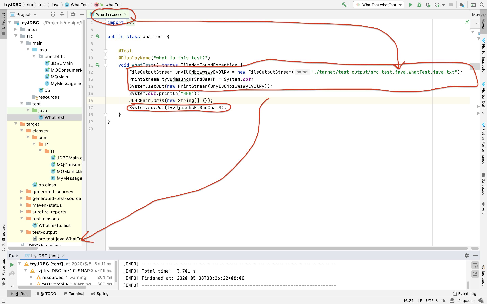
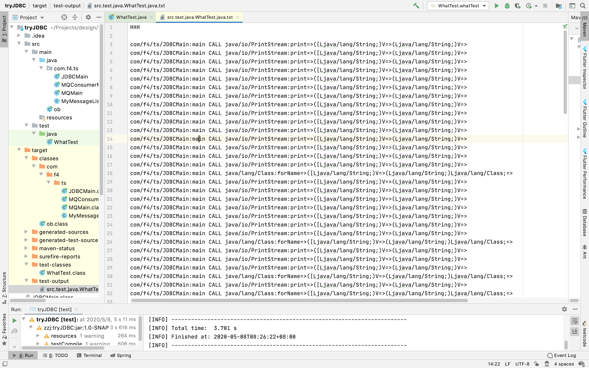

# stub-maven-plugin

## usage

```xml
<plugin>
    <groupId>org.f4</groupId>
    <artifactId>stub-maven-plugin</artifactId>
    <version>1.0-SNAPSHOT</version>
    <executions>
      <execution>
        <id>make-stub</id>
        <phase>process-classes</phase>
        <goals>
          <goal>stub</goal>
        </goals>
      </execution>
      <execution>
        <id>redirect-output</id>
        <phase>process-test-sources</phase>
        <goals>
          <goal>redirect</goal>
        </goals>
      </execution>
    </executions>
</plugin>
```
## 这个插件做了什么？
从上述的 pom 片段中可以看到，本插件主要应用在 process-classes 以及 process-test-sources 阶段，分别是对已经编译过的 
class 文件进行插桩从而在产生调用时 println 有关调用关系，以及对测试类的 Java 文件进行源代码修改从而将上述的
println 重定向到文件中。
### Stub
所有的编译之后位于 ./target/classes 的 class 文件都会插桩。
### Redirect
所有位于 ./src/test/java 的文件都会被修改，在所有函数头部加入
```java
FileOutputStream unyIUCMbzwwswyEyDlRy = new FileOutputStream(\"" + outPutPath + "\");
PrintStream tyvUjmsuhcHfSndOaaTM = System.out;
System.setOut(new PrintStream(unyIUCMbzwwswyEyDlRy));
```
在所有的函数尾部加入
```java
System.setOut(tyvUjmsuhcHfSndOaaTM);
```
可以看到，无非就是重定向到一个文件中，这个文件在 ./target/test-output/src....java.txt 中，src 到 java 之间的就是把这个测试文件的路径中的 '/' 换成 '.'。那些奇怪的变量名称是随机的，主要是担心重复了。



大致逻辑就如上图所示，红色圈出来的四行都是由插件生成出来的。文件具体内容如下：



所有的 innvokevirtual 都会被记录下来，用于后续的分析。